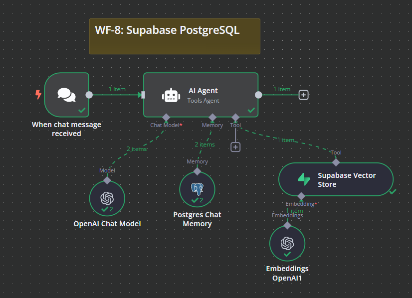
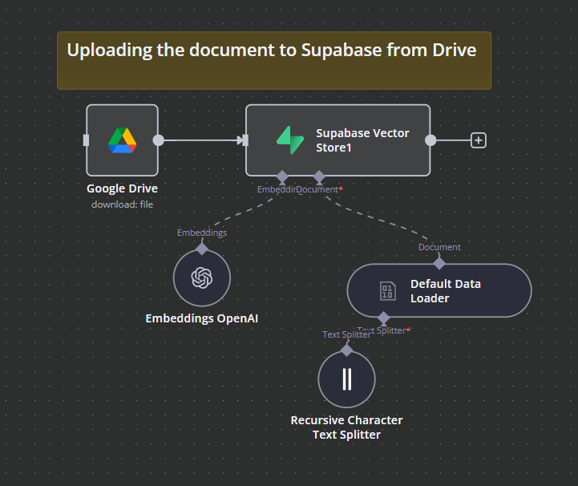

# WF-8: Supabase PostgreSQL – n8n Workflow

## 📌 Overview
This **n8n workflow**, `WF-8: Supabase PostgreSQL`, automates document retrieval and chat memory storage using Supabase and PostgreSQL. It processes chat messages, retrieves relevant documents, and stores interactions in a PostgreSQL chat memory for enhanced AI-driven responses.

## 🔧 Workflow Components
### 🏗️ Core Modules
1. **💬 Chat Trigger** – Listens for new chat messages to initiate the workflow.
2. **🤖 AI Agent** – Processes chat queries and interacts with other components.
3. **🧠 OpenAI Chat Model** – Enhances AI responses using OpenAI's GPT-4o-mini model.
4. **🗃️ PostgreSQL Chat Memory** – Stores and retrieves chat interactions from a PostgreSQL database.
5. **📚 Supabase Vector Store** – Retrieves relevant document information based on queries.
6. **📂 Google Drive Integration** – Downloads documents from Google Drive for vector storage.
7. **🔢 OpenAI Embeddings** – Converts document text into embeddings for retrieval.
8. **📄 Text Splitter** – Splits large documents into manageable text chunks for vectorization.

## ⚙️ How It Works
1. 💬 **Chat Trigger** activates when a new message is received.
2. 🤖 The **AI Agent** processes the message and interacts with relevant data sources.
3. 🧠 **PostgreSQL Chat Memory** stores past interactions for contextual understanding.
4. 📚 If needed, the **Supabase Vector Store** retrieves related documents based on embeddings.
5. 📂 The workflow allows **Google Drive** integration to upload new documents into the vector store.
6. 🔢 **OpenAI Embeddings** generate vector representations of documents.
7. 📄 **Text Splitter** processes large documents into structured text for better retrieval.
8. 📝 The **AI Agent** then generates a response based on retrieved knowledge.

## 📷 Workflow Screenshot

## 🚀 Setup Instructions
- 📥 **Import the workflow** into `n8n`.
- 🔑 **Configure API credentials** for OpenAI, PostgreSQL, and Supabase.
- 📂 **Ensure Google Drive access** for document uploads (if applicable).
- ✅ **Activate the workflow** to begin processing chat queries and document retrieval.

## 📝 Notes
- ⚠️ The workflow is **inactive by default**.
- 🛠️ Customize retrieval settings and database configurations as per your requirements.
- 📊 Optimized for **document-based chat memory storage** using Supabase and PostgreSQL.

